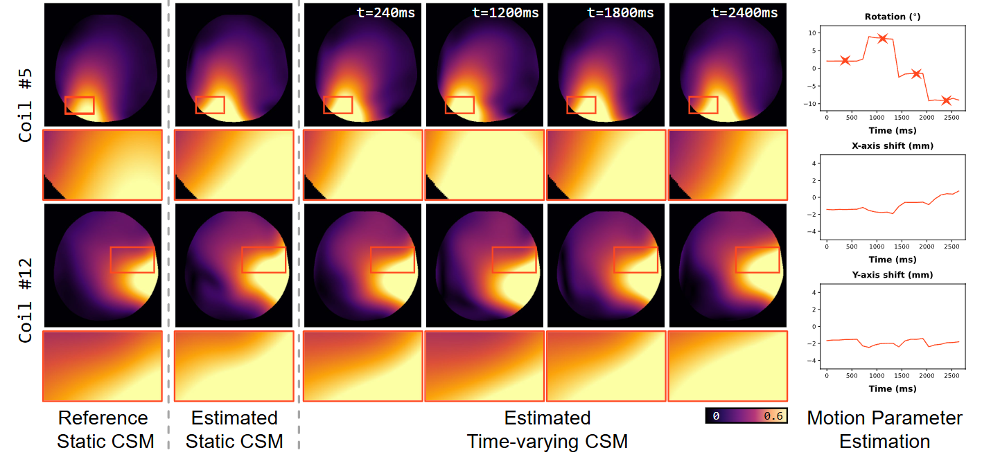

# JSMoCo
This repository is the PyTorch implementation of our manuscript "Joint Coil Sensitivity and Motion Correction in Parallel MRI with a Self-Calibrating Score-Based Diffusion Model". 

Our code will be available soon!!! 

----
### 1. Pipeline of JSMoCo

  
  Fig. 1: The pipeline of JSMoCo.

----

### 2. Time-Varying Coil Sensitivity Estimation from *in-vivo* data


  Fig. 2: Qualitative comparisons of jointly estimated static and time-varying coil sensitivity maps (CSMs) by JSMoCo.

### 3. Motion Correction on *in-vivo* T2w MRI data

 
  Fig. 3: Quantitative comparisons of reconstruction results for motion-corrupted real-world T2w human brain MRI scans with an acceleration factor $R=2$. 

----
## 4. License

This code is available for non-commercial research and education purposes only. It is not allowed to be reproduced, exchanged, sold, or used for profit.

## 5. Citation
If you find our work useful in your research, please site:

```
@article{chen2023jsmoco,
  title={JSMoCo: Joint Coil Sensitivity and Motion Correction in Parallel MRI with a Self-Calibrating Score-Based Diffusion Model},
  author={Chen, Lixuan and Tian, Xuanyu and Wu, Jiangjie and Feng, Ruimin and Lao, Guoyan and Zhang, Yuyao and Wei, Hongjiang},
  journal={arXiv preprint arXiv:2310.09625},
  year={2023}
}

```
